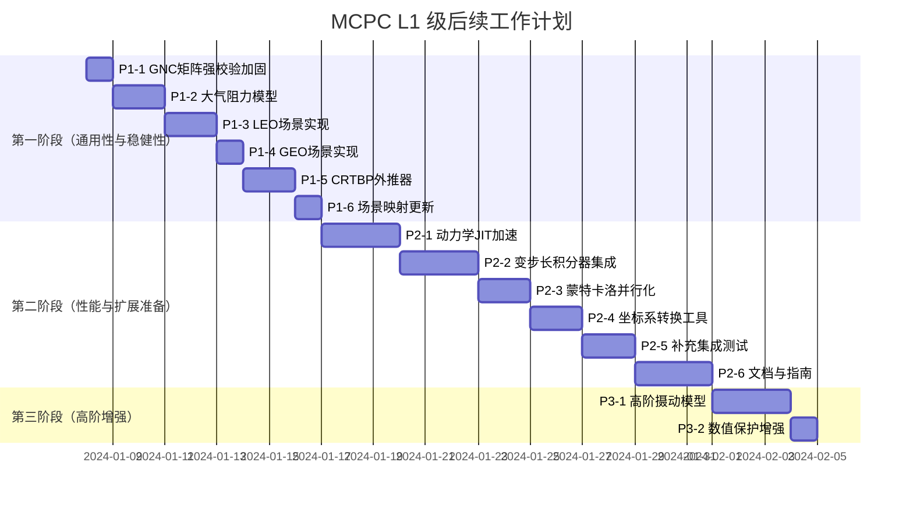

## MCPC L1 级后续工作计划（最终版）

### 一、目标定位

在现有 L1 级“日地 L2 点 Halo 轨道仿真”基础上，全面提升框架的**通用性**、**工程稳健性**和**扩展准备度**，使其能够支持 LEO/GEO 等近地任务，并为 L2 级编队协同仿真奠定坚实底座。

---

### 二、核心工作原则

1. **防御性编程（Defensive Programming）**：所有核心模块实施严格的输入校验，不可修复的错误必须“快速失败”（Fail-Fast），禁止静默降级。
2. **架构优先**：新增功能必须遵循现有设计模式（策略模式、工厂模式、模板方法），保持代码一致性与可扩展性。
3. **性能与可读性平衡**：在热点函数采用纯函数 JIT 加速，但保持面向对象架构的清晰性。
4. **测试驱动**：每个新增功能必须配套单元测试和集成测试，确保回归稳定性。

---

### 三、关键任务清单（按优先级）

#### 🔴 第一阶段（第 1-2 周）：通用性与核心稳健性

| 编号     | 任务               | 详细内容                                                     | 验收标准                                                     | 采纳来源               |
| -------- | ------------------ | ------------------------------------------------------------ | ------------------------------------------------------------ | ---------------------- |
| **P1-1** | GNC 矩阵强校验加固 | 重构 `_validate_and_fix_K_matrix`，移除静默备用增益，对不可修复的形状抛出 `ValueError` | 错误形状 K 矩阵导致仿真立即终止并指向 `_design_control_law`；单元测试覆盖可修复形状（如 `(6,)`） | Gemini 建议 + 自身评估 |
| **P1-2** | 大气阻力模型       | 实现 `AtmosphericDrag` 类，采用指数大气模型，支持配置参考密度、标高、阻力系数 | 单元测试验证加速度方向正确；LEO 场景集成测试中燃料消耗在合理范围（~0.1-0.5 m/s/天） | 自身评估               |
| **P1-3** | LEO 仿真场景       | 创建 `simulation/twobody/leo.py`，注册 `J2Gravity` + `AtmosphericDrag`，使用 `KeplerianGenerator` 生成标称轨道 | 可通过 `run.py --scene leo --level 1` 运行 1 天仿真，输出燃料账单 | 自身评估               |
| **P1-4** | GEO 仿真场景       | 创建 `simulation/twobody/geo.py`，仅注册 `J2Gravity`         | 同上，验证 GEO 轨道维持燃料消耗（~0.01-0.05 m/s/天）         | 自身评估               |
| **P1-5** | CRTBP 外推器       | 实现 `CRTBPPropagator`，利用 `CRTBP.dynamics` 进行状态外推   | 在日地旋转系中，短时外推（<1 小时）误差比线性外推小 2 个数量级 | Gemini 建议 + 自身评估 |
| **P1-6** | 更新场景映射       | 在 `run.py` 的 `SCENE_MODULE_MAP` 中添加 `leo`、`geo` 入口   | 命令行可直接调用                                             | 自身评估               |

#### 🟡 第二阶段（第 3-4 周）：性能优化与扩展准备

| 编号     | 任务               | 详细内容                                                     | 验收标准                                                     | 采纳来源    |
| -------- | ------------------ | ------------------------------------------------------------ | ------------------------------------------------------------ | ----------- |
| **P2-1** | 动力学 JIT 加速    | 将核心动力学公式（CRTBP、J2、SRP）抽离为纯函数，使用 `@numba.njit` 装饰 | 热点函数执行速度提升 5-10 倍；类方法调用纯函数保持架构清晰   | Gemini 建议 |
| **P2-2** | 变步长积分器集成   | 引入连续积分器实例（`scipy.integrate.RK45`），在主循环中调用 `step()` 推进，支持事件检测 | 可配置 `integrator: "rk45"` 运行仿真，精度与 RK4 相当或更高，性能开销可控 | Gemini 建议 |
| **P2-3** | 蒙特卡洛并行化     | 改造 `control_robustness_analysis.py`，使用 `multiprocessing.Pool`，Worker 只计算不落盘，结果返回主进程汇总 | 8 核机器上总耗时降低 50% 以上，无文件锁冲突                  | Gemini 建议 |
| **P2-4** | 坐标系转换工具     | 在 `math_tools.py` 中增加 `inertial_to_rotating`、`rotating_to_inertial` 函数（支持日地旋转系 ↔ 惯性系） | 单元测试验证转换一致性（转换后逆向还原误差 < 1e-10）         | 自身评估    |
| **P2-5** | 补充集成测试       | 为 LEO/GEO 场景添加端到端测试，验证燃料消耗量级合理性        | `pytest tests/test_*_integration.py` 通过                    | 自身评估    |
| **P2-6** | API 文档与扩展指南 | 使用 Sphinx 生成 API 文档，编写“添加新场景”“添加新力模型”的扩展教程 | 本地构建 HTML，覆盖核心模块；扩展指南有完整代码示例          | 自身评估    |

#### 🟢 第三阶段（可选，第 5 周）：高阶增强

| 编号     | 任务               | 详细内容                                              | 验收标准                                    | 采纳来源             |
| -------- | ------------------ | ----------------------------------------------------- | ------------------------------------------- | -------------------- |
| **P3-1** | J3/J4 高阶摄动模型 | 扩展 `J2Gravity` 为 `J2J4Gravity` 或新增类            | 与高精度工具（如 GMAT）对比，误差在合理范围 | 自身评估（低优先级） |
| **P3-2** | 数值保护增强       | CRTBP 动力学中增加 r1/r2 最小值限制；SRP 距离过近保护 | 极端场景下不出现除零或 NaN                  | 自身评估             |

---

### 四、实施路线图

---

### 五、成功标准

- [ ] **功能完整性**：LEO/GEO 场景可通过命令行运行，输出燃料账单，燃料消耗量级合理。
- [ ] **稳健性**：错误形状的 K 矩阵导致仿真立即终止并提示明确错误信息。
- [ ] **性能**：动力学积分热点函数加速 5 倍以上；蒙特卡洛分析并行化后耗时降低 50%。
- [ ] **测试覆盖**：新增功能单元测试覆盖率 ≥ 80%；LEO/GEO 集成测试通过。
- [ ] **文档**：API 文档覆盖核心模块；扩展指南包含代码示例。

---

### 六、技术实施注意事项

| 任务                | 潜在陷阱                    | 规避方案                                                     |
| ------------------- | --------------------------- | ------------------------------------------------------------ |
| P2-1 Numba JIT      | 直接装饰类方法无效          | 抽离纯函数（如 `crtbp_dynamics_nd`），用 `@njit` 装饰，类方法调用纯函数 |
| P2-2 变步长积分器   | 每步调用 `solve_ivp` 开销大 | 实例化 `RK45` 积分器，主循环中调用 `step()` 推进，保持状态   |
| P2-3 蒙特卡洛并行化 | 多进程写同一 HDF5 冲突      | Worker 只计算返回指标，主进程统一落盘；或每个 Worker 独立临时文件，最终合并 |
| P1-2 大气阻力       | 密度模型参数需校准          | 使用标准大气模型（如 NRLMSISE-00）或可配置的指数模型，留出接口供后续升级 |

---

### 七、决策点：立即启动的任务

根据 **Fail-Fast** 原则和 Gemini 的建议，我建议从 **P1-1 GNC 矩阵强校验加固** 开始。

**原因**：
1. 改动范围小，风险低，能快速验证防御性编程理念。
2. 消除一个可能掩盖控制律设计错误的隐患，为后续 LEO/GEO 场景调试扫清障碍。
3. 树立“严格校验”的代码风格基调。

**下一步行动**：
我将立即生成 P1-1 的完整代码修改方案（含单元测试），供您审阅。完成后，我们将按计划顺序推进大气阻力模型和 LEO 场景。

请确认是否从 P1-1 开始，或希望调整顺序？