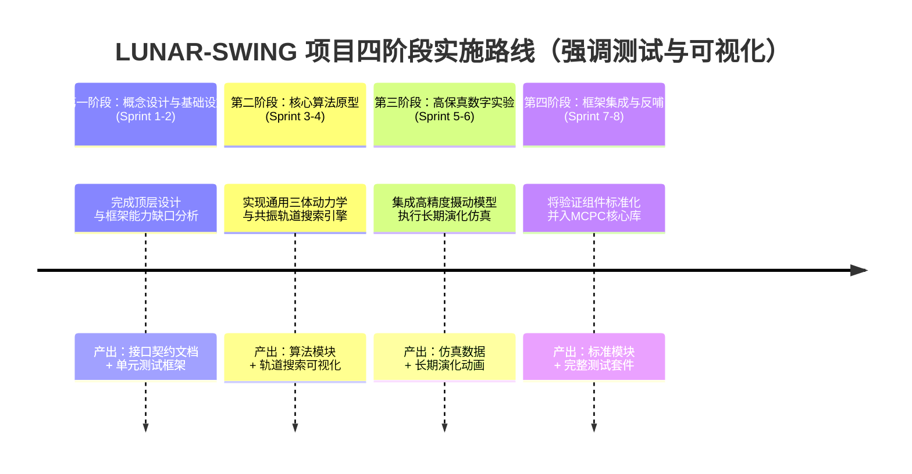

# 🌙 00. LUNAR-SWING 项目概览与分阶段实施框架

> **项目背景与科学目标请参阅：** [README.md](README.md)

## 🎯 1. 项目定位与双重目标

**LUNAR-SWING** 是 MCPC 数字镜像框架中的首个专项研究项目（一个验证场景）。它旨在**通过一个具体的、有挑战性的轨道问题，驱动并验证 MCPC 核心能力的系统性升级**。

### 1.1 双重验证目标
1.  **轨道概念验证**：在数字世界中，验证"地月共振摆动轨道"（结合大气穿越与月球引力维持）这一复杂动力学概念的**数学可行性**和**长期稳定性**。
2.  **框架能力验证**：以该轨道对高精度环境模型和数值算法的严苛要求为牵引，**填补 MCPC 数字镜像在"高保真度"方面的关键空白**，夯实框架底座。

### 1.2 核心验证原则
- **测试驱动**：每个功能组件都必须有对应的单元测试；每个功能集（模块组合）必须有集成测试。
- **可视化伴随**：每个阶段的成果都应生成可查看的图表或动画，直观展示验证效果。
- **可复现**：所有仿真结果都应有对应的配置文件、代码版本和随机种子，确保可完全复现。

## 📅 2. 整体实施路径（Sprint 驱动）

本项目采用 **"概念设计 -> 核心算法实现 -> 高保真仿真 -> 框架集成"** 的递进路径，共分为 **四个阶段**，以 Sprint（通常2-3周）为执行单元。



## 🏗️ 3. 分阶段概要方案（含测试与可视化）

### 阶段一：概念设计与基础设施准备 (Sprint 1-2)
**目标**：完成项目顶层设计，明确技术路线，并准备好 MCPC 框架升级所需的基础设施接口。

| 工作重点 | 具体任务 | 测试环节 | 可视化产出 |
| :--- | :--- | :--- | :--- |
| **概念设计** | 完成 `01_concept_design.md` 和 `02_swing_dynamics.md`，明确摆动轨道核心特征（共振比、近地点高度范围）。 | 文档评审会，交叉验证技术路线的可行性。 | 生成概念示意图：摆动轨道机制图、CRTBP坐标系示意图。 |
| **接口定义** | 完成 `05_infrastructure_upgrade.md`，定义高精度星历 (`HighPrecisionEphemeris`)、高阶重力场 (`HighOrderGeopotential`) 等新模块的**接口契约**。 | 为每个新接口编写**桩测试** (Stub Tests)，验证接口设计的合理性。 | 绘制模块依赖关系图，展示新旧模块如何集成。 |
| **测试框架** | 建立本项目的专用测试目录 `tests/lunar_swing/`，配置测试环境和基准数据。 | 运行现有MCPC测试套件，确保不破坏现有功能（回归测试）。 | 生成测试覆盖率报告（初始基准）。 |

**阶段出口标准**：
1.  所有概念设计文档就绪并通过评审。
2.  新基础设施模块的接口定义清晰，并有对应的桩测试。
3.  专用测试目录建立，回归测试通过。

### 阶段二：核心算法原型实现 (Sprint 3-4)
**目标**：在 MCPC 中实现摆动轨道搜索的核心算法引擎，并在简化模型（仅CRTBP）下验证其功能。

| 工作重点 | 具体任务 | 测试环节 | 可视化产出 |
| :--- | :--- | :--- | :--- |
| **算法设计** | 完成 `03_atmospheric_skip.md` 和 `04_resonance_search.md`，确定算法实现方案。 | 对算法伪代码进行桌面推演和边界条件分析。 | 生成算法流程图：打靶法迭代过程、STM计算流程。 |
| **CRTBP模型** | 实现 `UniversalCRTBP` 类，替换现有硬编码实现，支持任意双主天体系统。 | **单元测试**：验证能量守恒（雅可比常数）、与已知解析解（平动点）对比。 | 可视化CRTBP势能场和零速度面，展示允许运动区域。 |
| **轨道搜索器** | 实现 `LunarSwingTargeter` 原型，包含单参数打靶法和STM计算。 | **单元测试**：验证打靶法在二体问题中能收敛到精确周期轨道。<br>**集成测试**：在CRTBP中搜索已知的Halo轨道。 | 生成轨道搜索过程动画：显示迭代过程中轨道如何逐步闭合。 |
| **初步验证** | 使用新工具搜索一条简化的2:1或3:2共振轨道（无摄动）。 | **集成测试**：验证生成的轨道满足周期边界条件（位置残差<1e-6，速度残差不作约束）。 | 可视化找到的共振轨道：3D轨迹图、在庞加莱截面上的投影。 |

**阶段出口标准**：
1.  核心算法模块 (`UniversalCRTBP`, `LunarSwingTargeter`) 实现并通过单元测试。
2.  能在 CRTBP 模型下生成一条共振摆动轨道，并通过集成测试（周期闭合）。
3.  产出关键算法的可视化成果。

### 阶段三：高保真数字实验 (Sprint 5-6)
**目标**：将高精度环境模型集成到仿真中，执行长期数字实验，验证轨道在真实摄动下的稳定性。

| 工作重点 | 具体任务 | 测试环节 | 可视化产出 |
| :--- | :--- | :--- | :--- |
| **高精度模型** | 实现/集成 `HighPrecisionEphemeris` (如DE440) 和 `HighOrderGeopotential` (如EGM2008)。 | **单元测试**：与SPICE或已知星历工具的输出进行比对。<br>**单元测试**：验证球谐函数计算的正确性（与低阶J2模型对比）。 | **✅ 关键可视化**：使用新星历模块生成地月系统在J2000系下1年的运行轨迹动画。 |
| **大气模型** | 完善 `AtmosphericDrag` 模型，集成指数模型或NRLMSISE-00。 | **单元测试**：验证大气密度随高度变化的曲线符合预期。 | 绘制大气密度剖面图，标注任务涉及的高度范围。 |
| **专用场景** | 开发 `EarthMoonResonanceSimulation` 专用场景，集成所有力模型。 | **集成测试**：场景能正确初始化、运行并保存数据。 | 场景架构图，展示各模块的数据流。 |
| **长期仿真** | 运行1年以上的轨道演化仿真，分析能量平衡。 | **系统测试**：验证仿真结果的物理合理性（能量不应漂移过大）。<br>**比对测试**：与第二阶段的无摄动结果对比，量化摄动影响。 | **✅ 核心可视化**：生成长期演化动画，同步显示轨道变化、能量历史、近地点高度变化。 |
| **验证协议** | 完成 `06_validation_protocol.md`，定义与GMAT/STK的比对方法。 | 执行初步的跨软件比对，在简化场景下验证一致性。 | 绘制误差分析图（MCPC结果 vs. 参考软件结果）。 |

**阶段出口标准**：
1.  所有高精度模型通过单元测试，并成功集成到仿真场景中。
2.  完成长期演化仿真，产出数据和分析报告。
3.  生成核心可视化成果：天体运行轨迹和轨道长期演化动画。

### 阶段四：框架集成与能力反哺 (Sprint 7-8)
**目标**：将本项目验证通过的可靠组件标准化，并入 MCPC 核心库，完成项目成果的沉淀和转移。

| 工作重点 | 具体任务 | 测试环节 | 可视化产出 |
| :--- | :--- | :--- | :--- |
| **代码重构** | 将稳定版本的新模块正式合并到 `mission_sim/core` 相应目录，遵循MCPC代码规范。 | **回归测试**：确保合并后所有原有测试仍然通过。 | 生成代码变更影响图。 |
| **测试完善** | 完成 `07_test_plan.md`，为新模块补充完整的单元测试、集成测试和性能测试。 | 运行完整的测试套件，达到目标覆盖率（如>90%）。 | 生成最终的测试覆盖率报告和性能基准报告。 |
| **文档与案例** | 编写用户文档、API文档，并将 `lunar-swing` 场景打造为MCPC的示范案例。 | 文档评审，案例的可复现性验证。 | 创建项目成果总览图，展示从概念到可运行代码的全链路。 |
| **知识转移** | 进行内部技术分享，将项目经验沉淀为框架开发指南的一部分。 | - | 制作技术分享PPT和演示视频。 |

**项目最终出口标准**：
1.  **概念得到验证**：在MCPC数字镜像中，证实了地月共振摆动轨道在考虑主要摄动后的可行性。
2.  **框架能力提升**：MCPC 增加了高精度星历、高阶重力场等关键能力，并有完整测试覆盖。
3.  **资产完整沉淀**：形成了一套完整的、经过测试的轨道设计工具链和可复用的数字实验场景。
4.  **流程完成闭环**：完成了从概念设计、测试验证、可视化到框架反哺的完整闭环。

## 🔗 4. 文档与成果的演进关系

```
00_project_overview.md (本文档)        # 总纲，指引所有后续工作
    ├── 📄 01_concept_design.md          # 阶段一：为什么做？做什么？
    ├── 📄 02_swing_dynamics.md          # 阶段一：理论基础是什么？
    ├── 📄 05_infrastructure_upgrade.md  # 阶段一：框架需要什么新能力？（接口设计）
    │
    ├── 📄 03_atmospheric_skip.md        # 阶段二：关键技术1如何实现？
    ├── 📄 04_resonance_search.md        # 阶段二：关键技术2如何实现？
    │   └── 代码实现：`LunarSwingTargeter`, `UniversalCRTBP`
    │
    ├── 📄 06_validation_protocol.md     # 阶段三：如何确保结果可信？
    │   └── 代码实现：`EarthMoonResonanceSimulation` 场景
    │
    └── 📄 07_test_plan.md               # 阶段四：如何保证代码质量？
        └── 代码实现：测试用例，代码重构与入库
```

## 💡 5. 下一步行动建议

基于此分阶段概要方案，我们接下来可以：

1.  **评审与定稿**：对本文档 (`00_project_overview.md`) 进行评审，确认各阶段的**测试环节**和**可视化产出**是否合理、明确。
2.  **启动 Sprint 1**：根据第一阶段的任务，立即开始：
    - 完善 `01_concept_design.md` 和 `02_swing_dynamics.md` 的最终版本。
    - **同步**开始编写 `05_infrastructure_upgrade.md` 的接口定义部分，并**立即**为这些接口创建桩测试文件。
    - 建立 `tests/lunar_swing/` 目录结构。
3.  **可视化先行**：在 Sprint 1 中，就可以开始构思和绘制阶段一要求的可视化产出（概念示意图、模块依赖图），这有助于澄清设计思路。

---
*文档状态：🌱 草案 - 待评审*
*最后更新：2026-04-04*
*核心原则：每个功能都有测试，每个阶段都有可视化*
